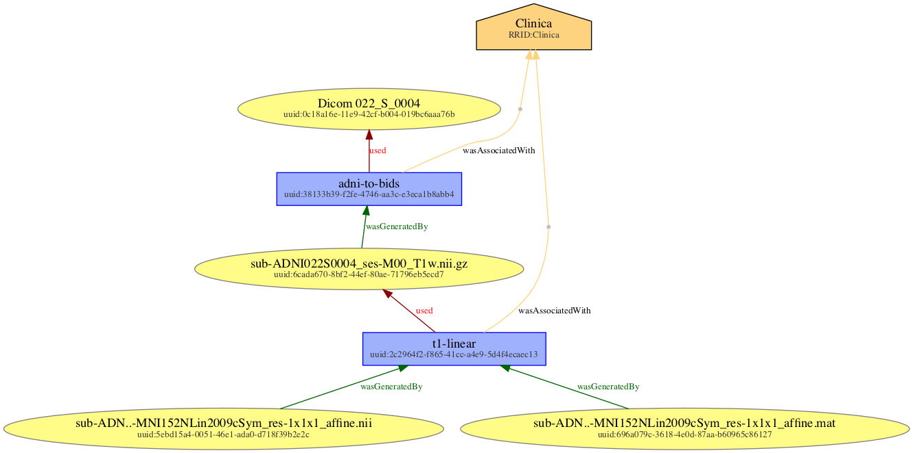

## 2-step workflow using Clinica (https://github.com/aramis-lab/clinica)

---

### Workflow

<center>

</center>

---

### Generate a graph

from the root of this project

```bash
python bids_prov/visualize.py examples/clinica_pipelines/adni-to-bids.jsonld examples/clinica_pipelines/t1linear_mat.jsonld examples/clinica_pipelines/t1linear_nii.jsonld -o clinica_pipelines.png
```

generates the graph illustrating the provenance of files related to two Clinica pipelines (adni-to-bids and t1-linear) 
