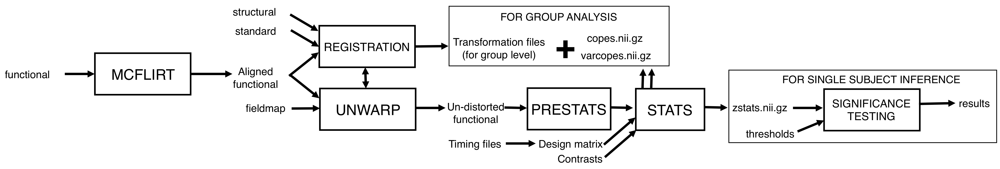

## workflow for "Feat 1 Practical" example

------------------
### Steps
Tutorial available [here](https://fsl.fmrib.ox.ac.uk/fslcourse/lectures/practicals/feat1/index.html)

-------------------
### Workflow

--------------------
### Docker
[This image](https://hub.docker.com/r/vistalab/fsl-v5.0) was used to reproduce experiments
